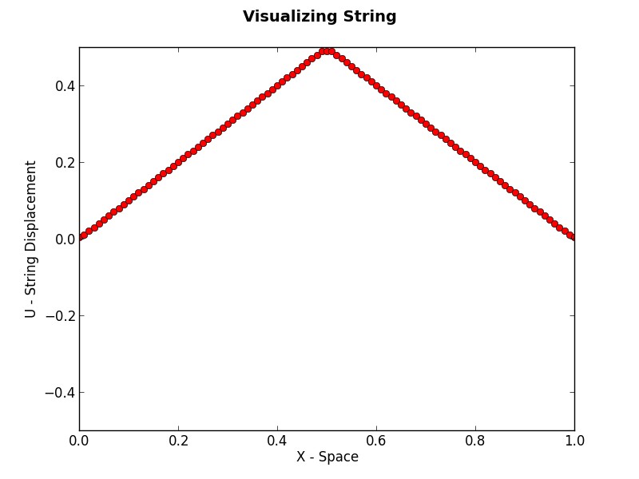
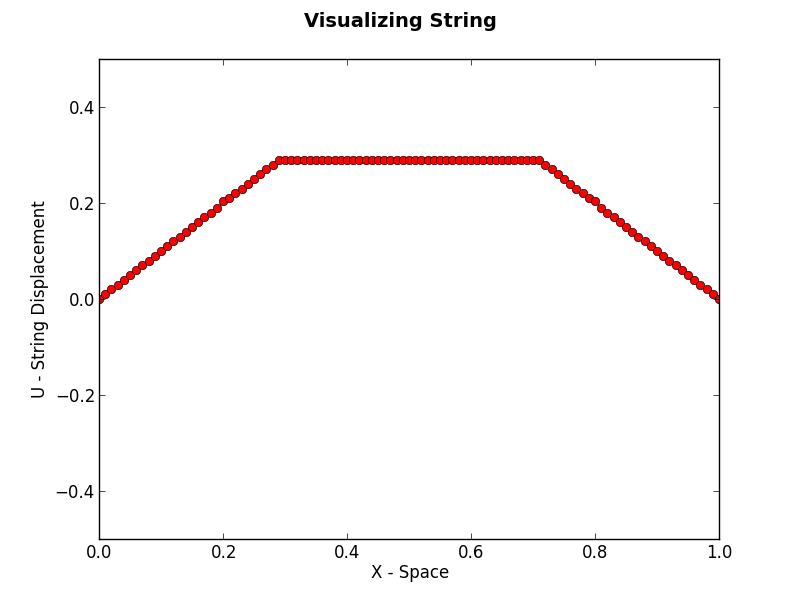
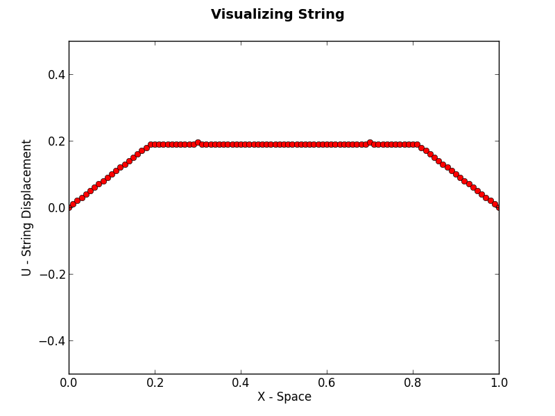
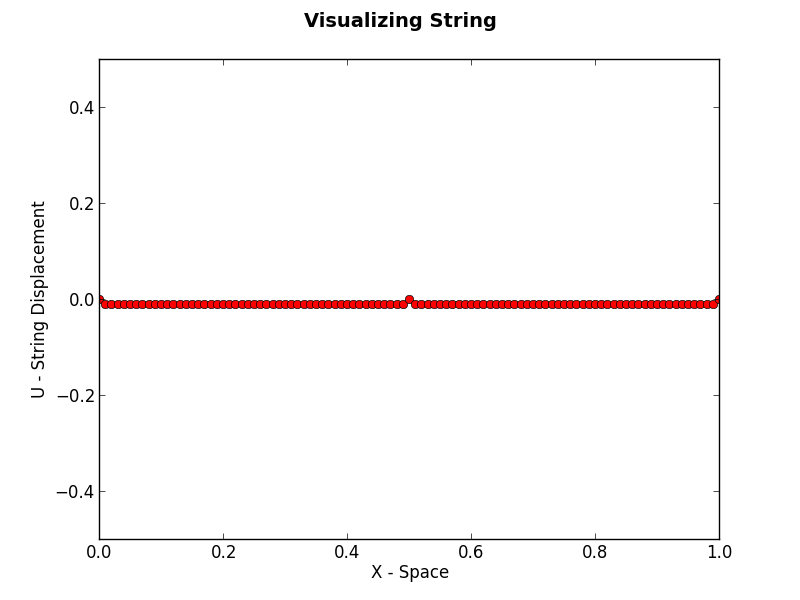
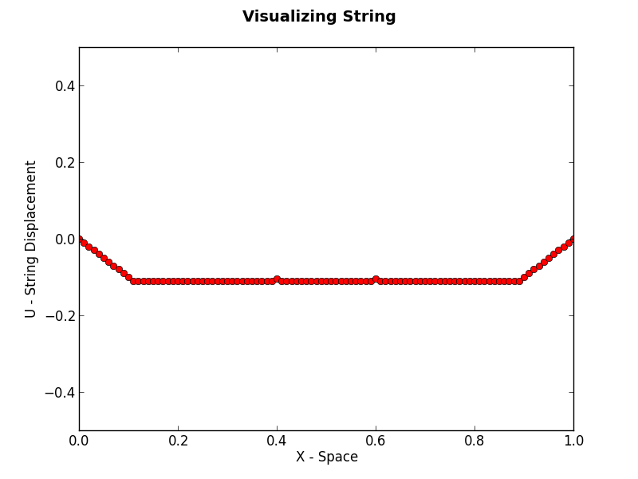

Jervis Muindi   
Numerical Algorithms and Complexity    
April 2013
Homework 7    

Introduction
============
This project contains code that visualizes the solution to the model problem of a vibrating string. 

Dependencies
===========
* Matpotlib: Please see [http://matplotlib.org/users/installing.html](this guide) for instructions on installing Matplotlib.

How to Run
==========
python main.py [x-width] [t-width] [total_time] [graph_rate]  
     x-width : amount of x-spacing between points   
     t-width: delta in time to be applied in a single step forward   
     total_time: amount of time be used in simulating the system   
     graph_rate: A graph should be drawn/plotted every "graph_rate" steps    

Example:    

`python main.py 0.01 0.01 2 10`   

Sample Output
============
Below is some sample output obtained from running the script. 

